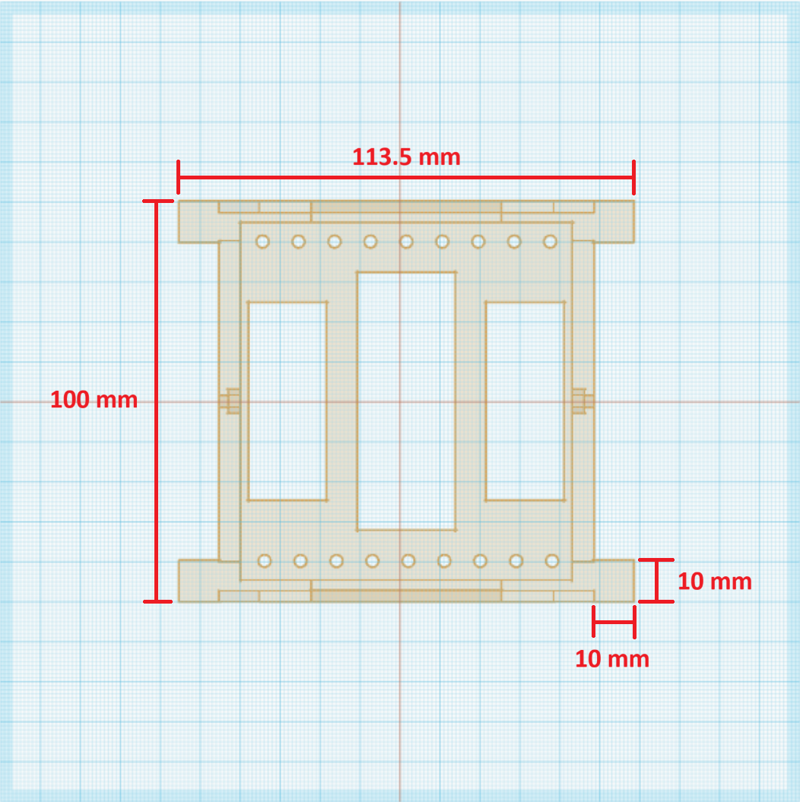
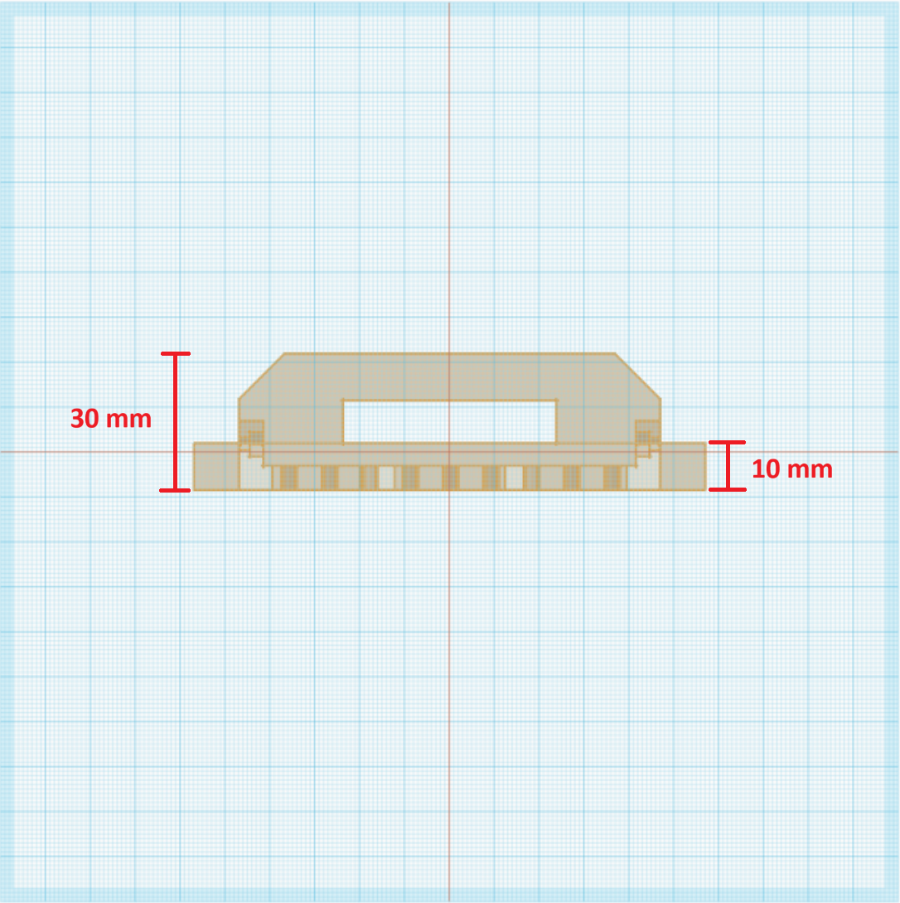
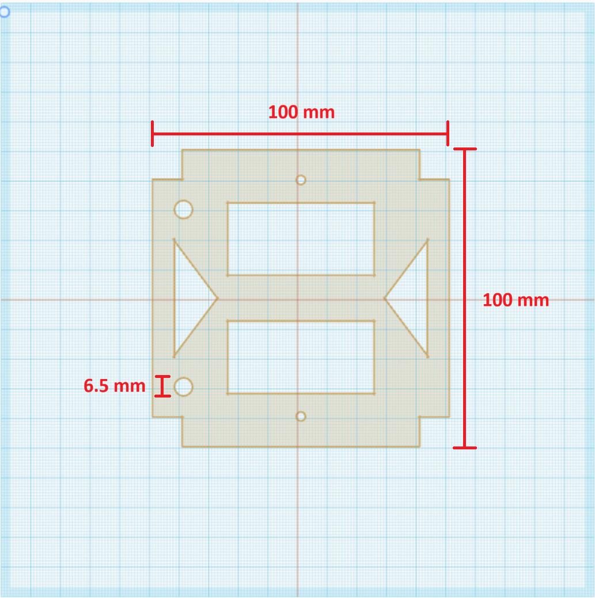
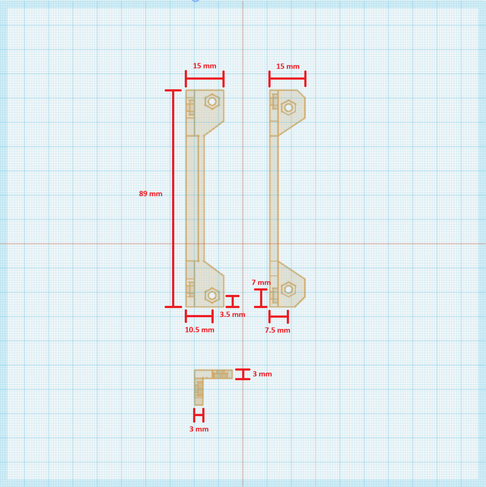

# Satellite Frame

This is the repository for MOSAIC's 3D printed satellite frame.

For detailed information on the frame, check out its core documentation [here](https://www.mosaicsat.org/core_documentation/hardware/frame/).

To get your own MOSAIC frame, visit the MOSAIC fabrication guide [here](https://www.mosaicsat.org/getting_mosaic/).

## Planned Changes

The following are the current plans for changes to MOSAIC's frame. 

- Satellites often have sensors adhered to the exterior or interior of their frame, which point outside of the satellite (like a camera, for example). Future iterations of MOSAIC's frame will include mounting points to easily add these sensors, which can be connected to the ProtoBoard using a Qwiic cable. 
- Future versions of MOSAIC's frame may explore other methods of securing the satellite's internal boards that don't require the side brackets. 
- MOSAIC's frame was designed using TinkerCAD. This is a free, online CAD program that is easy to use. However, it doesn't easily allow for sharing editable frame files. Therefore, future versions of MOSAIC's frame will be created using CAD software or a website that allows external users to modify the 3D files. 

## Change Log

You can find the change log for the Power Board on MOSAIC's website [here](https://www.mosaicsat.org/core_documentation/hardware/frame/change_log/). 

## Frame Dimensions

### Main Frame:

Top view: 

Side view:

### Z-Face Panels

Top view:

### Board Brackets

